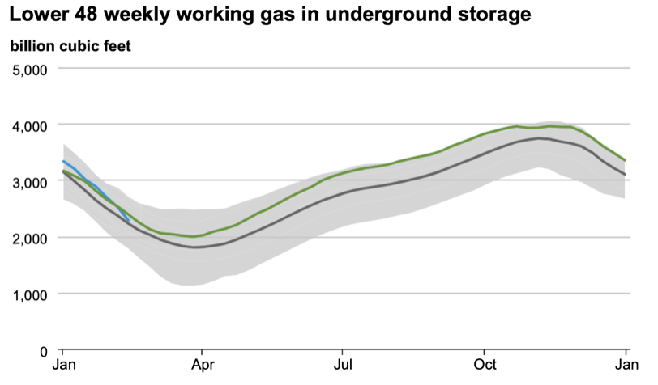

This section aims to provide necessary background information of algorithmic trading and quantitative risk management. Specifically, due to the fundamental dynamics inherent in the gas market, the two crucial aspects of risk management in gas trading will be outlined: precise gas price prediction and gas storage plan optimization. This paper was dedicated to tackling the latter.

## 2.1 Algorithmic Trading
  

Algo trading utilizes algorithms to execute high-speed, automated trades in financial markets. These algorithms are designed to analyze market data, identify trading opportunities, and automatically execute orders at optimal prices and speeds. Algo trading aims to capitalize on market inefficiencies and is widely used by investors for precise, efficient and rapid trading execution.
## 2.2 Dynamics of the Gas Market
In the preliminary stages of algorithmic design and deployment, in order to select an appropriate method to explore market’s behavior, a comprehensive understanding of market dynamics is imperative, especially considering the significant variations observed across different markets. In the context of our discourse, primarily centered on gas markets, it is crucial to take an initial inspection of it.

The gas market exhibits two basic market dynamics, prominently characterized by seasonal trends and high volatility. Firstly, the market's responsiveness to weather conditions and changes in supply and demand plays a pivotal role. Secondly, the market is influenced by broader external factors, including geopolitical instability and regulatory changes. These elements introduce uncertainty and augment the market's inherent instability. Lastly, infrastructure constraints and inventory levels constitute critical dynamics, shaping the market's operational efficiency and influencing pricing mechanisms. Together, these dynamics underscore the multifaceted nature of the gas market, subject to a spectrum of influences that jointly determine its trajectory.

## 2.3 Quantitative Risk Management in Gas Market
Due to the intricate and fluctuating nature of the gas market, the imperative for quantitative risk management becomes evident. This involves two key aspects: the precise prediction of gas prices and the formulation of optimal storage plans. Exploring quantitative risk management in the gas market underscores the importance of these dual objectives in mitigating risks and improving decision-making.

### 2.3.1 Gas Price Prediction
  
{ width=80% }
  
In this context, accurate gas price prediction is crucial. To model seasonality, time series analysis methods such as Fourier transform or Autoregressive Integrated Moving Average(ARIMA) models prove effective, capturing recurring patterns over specific time intervals. For volatility, methods like Generalized Autoregressive Conditional Heteroskedasticity(GARCH) models are employed to assess and predict the degree of price fluctuations, aiding in strategic planning and risk management. The collaboration of these forecasting methods enhances the robustness and adaptability of the strategy, addressing the complex dynamics of the gas market.

### 2.3.2 Gas Storage Planning
  
{ width=80% }
  
Gas storage planning is another aspect of managing gas reserves efficiently. This strategic process involves determining optimal plans for storing and withdrawing gas, aligning with multiple constraints. The importance lies in ensuring a reliable and responsive supply to meet varying demands through three key aspects. First of all, formulating the optimal storage strategy involves customizing it to align with seasonal demand fluctuations, considering infrastructure capacities, storage expenses, and operational restrictions. Secondly, implementing hedging strategies, using financial instruments such as forward contracts, to safeguard against price fluctuations. Thirdly, dynamic adaption of storage plans through continuous assessment of market changes, allowing for a flexible adjustment to evolving conditions. 

---