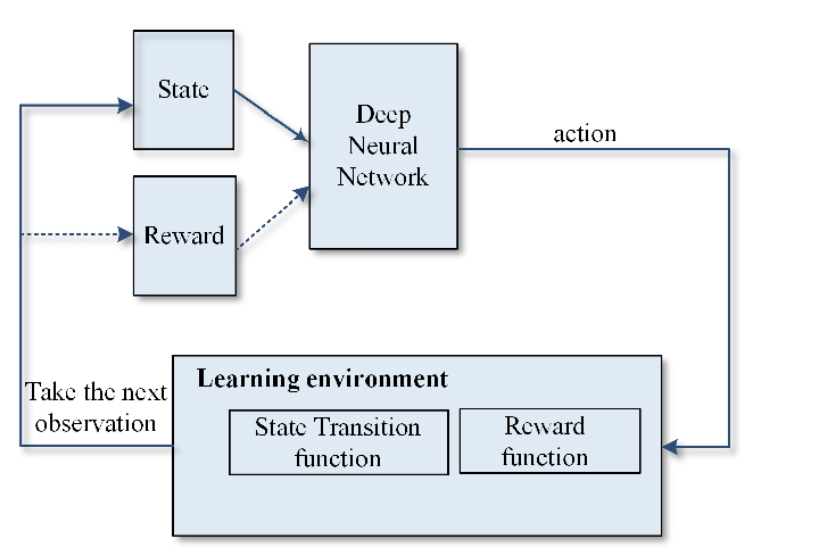
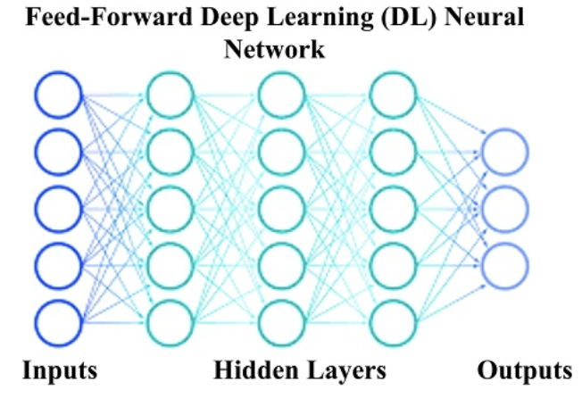
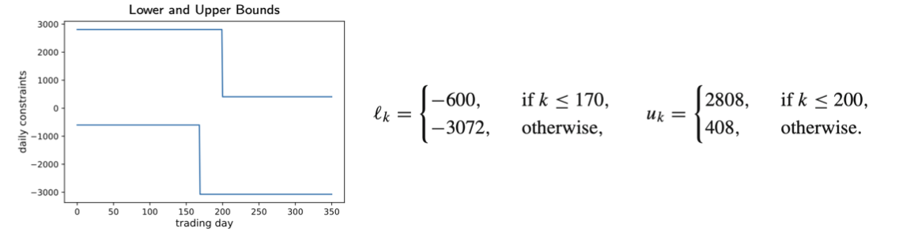
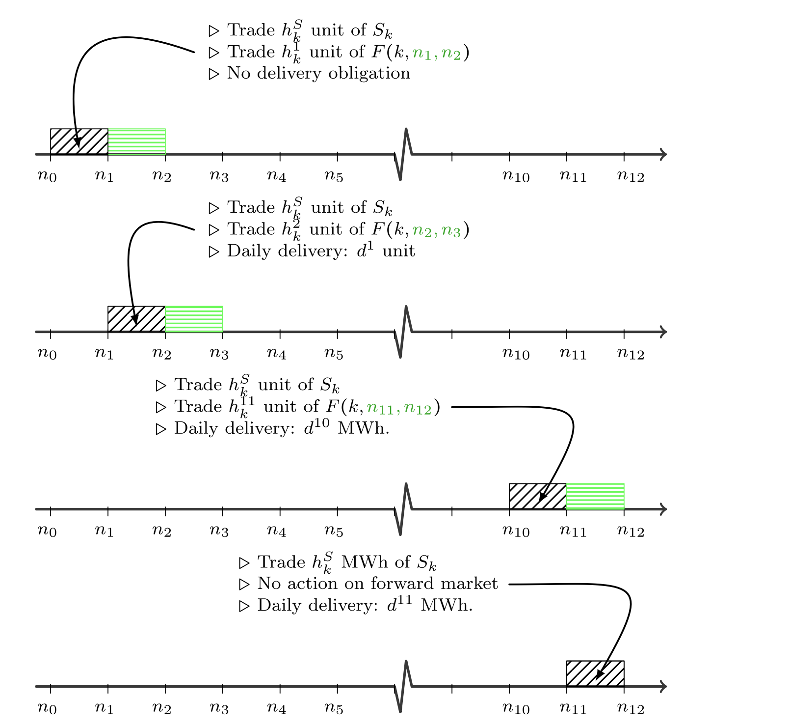

This section will center on the framework introduced in the paper, which aims to optimize gas storage by means of deep hedging. It will begin with how to customize neural networks in order to develop hedging strategies, elucidating the concept of deep hedging. Following that, attention will be directed towards the two frameworks - **SMod** and **SFMod**, each tailored to specific scenarios: one focusing solely on spot trading, while the other adopts a more complex approach involving forward trading. Both of them are based on intrinsic valuation, which means assessing the fundamental worth of traded assets rather than short-term market fluctuations or speculative factors. Then an in-depth presentation of the training setup for the two scenarios of varying complexity will encompass crucial elements for neural network training setup including datasets, network architecture, loss functions, optimization algorithms and hyperparameters.

## 4.1 Deep Hedging
Hedging is a risk management strategy for protecting against market volatility and uncertainty, allowing investors to safeguard their portfolios and achieve more stable returns. For example, in gas trading, a company that anticipates a decrease in gas price may hedge its position by purchasing futures contracts to lock in a more favorable price. This strategy helps mitigate potential losses if prices decline, ensuring more predictable revenue streams for the company. 

Traditional methods for developing hedging strategies, such as statistical analysis and derivatives pricing methods, rely on historical data and heavy mathematical equations to identify risks and formulate positions. These methods may struggle to capture complex market patterns and nonlinear relationships, leading to less accurate predictions. In contrast, deep learning offers a powerful tool for processing large datasets and learning complex patterns directly from the data, making them more robust and adaptive in dynamic market conditions.

 

The above graph shows the basic architecture of [deep reinforcement learning]. A popular approach within deep reinforcement learning centers on using (feed-forward) neural networks to approximate optimal actions, as neural networks are well-suited for such intricate tasks due to their versatility and efficient training capabilities. Then the storage optimization tasks should be reformulated such that it fits the structure of neural networks. Approximate each action $$h_k$$ in terms of a deep neural network $$g^\theta _k$$, parameters $$\theta$$ of these network strategies $$G^\theta = \{g_0^\theta, ...,g_{K-1}^\theta\}$$ are trained to maximize an estimate of the expected terminal utility, i.e., to solve $$\text{ max}{}_\theta \mathbb{E}_\mathbb{P}[U(W_{G^\theta})]$$

### Definition: Feed-Forward Neural Network
Let $$L\in \mathbb{N}$$, a feed-forward neural network $${g}^\theta$$ is defined as $$A^L \circ \phi \circ A^{L-1} \circ ... \circ \phi \circ  A^1(x)$$, where
* $$L\in \mathbb{N}$$ - number of layers                                                              
* $$\phi(\cdot)$$ -non-linear activation function
* $$A^l, l=1,...,L$$ -affine linear maps in the respective dimensions, whose parameters are stored in $$\theta$$

## 4.2 SMod: intrinsic spot trading
### 4.2.1 Scene Setting
**Spot trading**: immediate purchase or sale of financial instruments or commodities for instant delivery at the current market price. In the context of gas trading, day-ahead price can be seen as close proxy of the spot trading.

Following variables are required to build the neural networks:

| Variable|  Interpretation|
| :----------- |: ----------- |
| $$s_k$$ | the $$\mathbb{F}$$-adapted gas spot price| 
| $${h}^S_k$$|  action on day $$k$$ | 
| $${H}^S=\{h^S_0,{h}^S_1,...,{h}^S_{K-1}\}$$| a trading strategy over the whole trading horizon| 
| $$({H}^s \cdot S)_{K-1} = \sum_{k=0}^{K-1}{h}^S_ks_k$$ | terminal value |  
| $${H}^S_n= \sum_{k=0}^{n-1}{h}^S_k$$ |storage level on day n (Initial condition: $${H}^s_0=0 $$) | 
| $$U(x)=(1-{e}^{-\gamma x})/\gamma$$ | an exponential utility function with risk aversion rate $$\gamma \in \mathbb{R}^+$$ (A higher risk aversion rate indicates a stronger preference for avoiding risk or uncertainty whenmaking financial decisions.)| 

The optimization goal should be the expected terminal utility $$\mathbb{E}_\mathbb{P}[U(W_{K-1})]$$ over all eligible $${H}^s$$ where $$W_{K-1}=-({H}^s \cdot S)_{K-1} = \sum_{k=0}^{K-1}-{h}^s_ks_k$$ denotes the terminal p&l.

Meanwhile, this optimization process must adhere to the following constraints:
1. $${H}^S_K =0$$, i.e., empty final storage(intuitive for any profit-seeking agents)
1. For all $$0 \leq {H}^S_k\leq c$$ (storage level on any day must not exceed storage capacity $$c$$) and daily action constraints $$l_k^* \leq {h}^S_k\leq u_k^*$$, where $$l_k^* = \text{max}\{l_k,-H_k^S\}$$ and $$u_k^* = \text{min}\{u_k,c-H_k^S\}$$. The withdrawal and injection rates on each trading day must be limited by the storage level $${H}^S_K$$ and a predefined lower and upper bounds $$l_k$$ and $$u_k$$ to fit the seasonal demands and supply patterns.
  

### 4.2.2 Training Setup
#### Training Data
Time horizon of storage $$T=\{0, 1, 2, ..., K-1\}$$, $$M$$ trajectories of the spot price $$({S^i}_k)_{k \in T; i=1,...,M}$$()
#### Training Object
#### Training Criterion**
#### Implementation
_TENSORFLOW.KERAS_ with _sigmoid_ activation function
#### Hardware
A standard 8-core notebook
  
## 4.3 SFMod: intrinsic spot and forward trading
### 4.3.1 Scene Setting
**spot and forward trading**: extend the previous spot-only model by trading additionally on the front month rolling forwards with delivery period of a whole month.

Compared to the scenarios outlined in SMod, in this context, it is imperative to aggregate the outcomes of forward trading on each trading day and consider the cumulative impact from that. The above visualization shows the forward trading mechanisms. The arrow points to the current timeframe. The black box refers to the spot trading activites and the green box refers to the forward trading activities. In SFMod, let $$0=n_0 < n_1< ... < n_J <K$$ be the first days of the months $$\mathbb{J}=\{0, 1, ..., J\}$$ respectively, let $${h}^j_k$$ with $$j \in \mathbb{J}$$ be the action on day $$k$$ on the forward $$F(k, n_j, n_{j+1}-1)$$ whose delivery obligation is during the period $$[n_j, n_{j+1}-1]$$, then the action on day $$k$$ is $$({h}^S_k+{d}^j)$$ for $$ n_j \leq k \leq n_{j+1}$$, which combines both spot trading and forward trading. Of particular importance is that forward trading activities have a delayed effect on the spot trading in the following month, while spot trading does not affect forward trading. After the respective forward trading has already terminated, the delivery quantities of the upcoming days in the current month are fixed, but the spot trading activities of the current month is limited by the due forwards, as the sum of the spot trading and thedaily delivery quantities must not exceed the daily withdrawl and injection limits.

### 4.3.2 Training Setup
---
[Deep reinforcement learning]: https://www.semanticscholar.org/paper/Semisupervised-Deep-Reinforcement-Learning-in-of-Mohammadi-Al-Fuqaha/6b72f4d16532f4e8f5ddd7640262019eea641fd6
