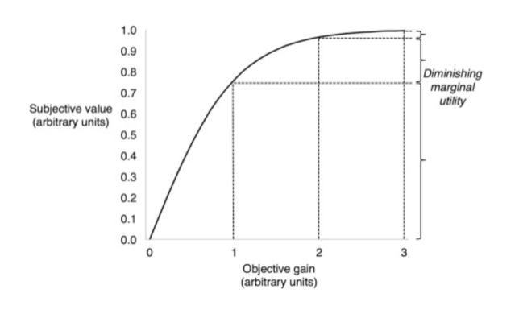

Following the foundational overview of gas trading, attention turns to the issues to be solved in this paper - a constrained optimization instance. In this scenario, imagine yourself as a gas producer whose responsibility is to carry out gas storage plans through storage facilities in order to maximize accrued wealth at the terminal time. Nevertheless, the optimization is bounded by constraints crucial for aligning with market dynamics and ensuring stability. For example, there are upper limits of the daily gas extraction rate. The gas storage manager cannot sell a significant volume of gas at peak prices and must embrace the duty of continuous gas delivery and maintaining market equilibrium. 
In this section, a detailed introduction will delve into the mathematical modeling of the constrained optimization problem, providing clarity on the parameters necessary for problem definition. Following that, the traditional methods and their associated limitations will be briefly discussed, which is anticipated to inspire your motivation in “deep hedging” in the upcoming section.

## 3.1 Mathematical Modeling

| Variables| Constraints  |
| :----------- |: ----------- |
| Initial storage | 0 units(plus cushion gas)| 
| Terminal storage |  0 units(plus cushion gas) | 
| Capacity | c | 
| Injection rate on day $$k$$ | $$u_k$$ units $$u_k>0$$ |  
| Withdrawal rate on day $$k$$ | $$l_k$$ units $$l_k<0$$ | 
| Injection cost | $$\kappa \in [0,1]$$| 
| Withdrawal cost | $$\kappa \in [0,1]$$| 
| Overhead(one time expense) | C$|  

_Remarks: In underground storage, there’s typically cushion or base gas, maintained to uphold minimal pressure. For simplicity, injection and withdrawal costs are assumed to be proportional to their respective actions in the above table, but in reality, these costs vary with the pressure in the underground storage. Furthermore, the parties often agree to overlook physical complexities when trading storage capacities._

The above table lists necessary parameters to define storage optimization constraints with unit: therm or MWh. In addition, the following variables are required to describe this problem adequately：

* A discrete time setting: $$T=\{0, 1, 2, ..., K-1\}$$ for some $$K \in \mathbb{N} $$ be the trading horizon in days
* A filtered probability space with real-world measure for modelling stochastic process: $$(\Omega,\mathbf{F}, \mathbb{F}, \mathbb{P})$$ with $$\mathbb{F}=(\mathbf{F}_k)_{k \in T}$$
* An equivalent risk-neutral measure $$\mathbb{Q}$$ representing the attitude of investors when facing risks

The goal of gas storage optimization is to determine optimal decisions within a constrained and uncertain market environment to maximize the expected terminal utility of accumulated wealth. More formally, let **$$h_k$$** be the action taken on day **$$k$$**($$h_k > 0$$refers to an injection of $$|h_k|$$ MWh and $$h_k < 0$$ refers to a withdraw of $$|h_k|$$ MWh), then a trading strategy over the whole trading horizon is collected in **$$H=\{h_0, h_1,..., h_{K-1} \}$$**. The agents seeks to identify an optimal strategy  satisfying: **$${H}^*= \text{arg max}{}_H \mathbb{E}_\mathbb{P}[U(W_H)]$$**, where **$$W_H$$** refers to the terminal wealth depending on the trading strategy $$H$$and the trading price curve, **$$U$$** refers to the utility function. Meanwhile, constraints such as the upper limit of withdraw or injection on each trading day with respect to certain storage level should be taken into consideration.

_Remarks: A utility function measures preferences by assigning numerical values representing satisfaction or happiness to accumulated wealth. The interesting part is "diminishing marginal utility", which means the rate of satisfaction growth is slowing down with each additional unit wealth. It examines various aspects of human behavior related to production, consumption, and distribution of goods and services, as well as the functioning of markets and economies. Utility functions in social science, such as economics, are widely employed, for example, make taxation policies._

## 3.2 Traditional Methods & their Limitations
Having domain-specific expertise, one can employ classical optimization methods such as Least-Squares Monte-Carlo(LSMC) and Support Vector Machine(SVM) regression as stochastic control problem with Hamilton-Jacobi-Bellman equations to tackle such a constrained optimization instance. Additionally, dynamic programming and real option theory can aid addressing such challenges. However, traditional techniques encounter the “curse of dimensionality”, which refers to the phenomenon where the computational complexity increases exponentially with the number of variables or dimensions in the problem. This poses challenges, as the number of dimensions grows, the amount of data required to accurately represent the problem space increases exponentially. Consequently, methods struggle to efficiently explore and analyze high-dimensional spaces, leading to computational inefficiencies and difficulties in finding optimal solutions.

Moreover, reinforcement learning is commonly utilized to optimize investment strategies within the financial domain. This approach frequently utilizes Markov Decision Processes(MDPs) to represent sequential decision-making scenarios. However, in numerous real-world contexts, especially in financial markets, supplementary information beyond the present state can enhance predictive capabilities and improve control. While reinforcement learning serves as inspiration, incorporating longer-term dependencies within each state would be advantageous, thereby accommodating a non-Markovian framework.

---