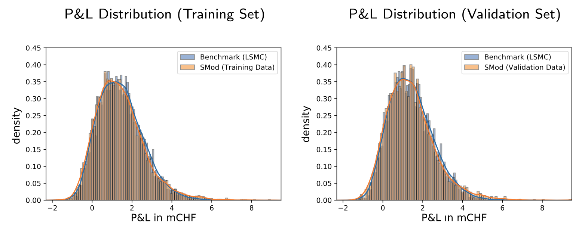
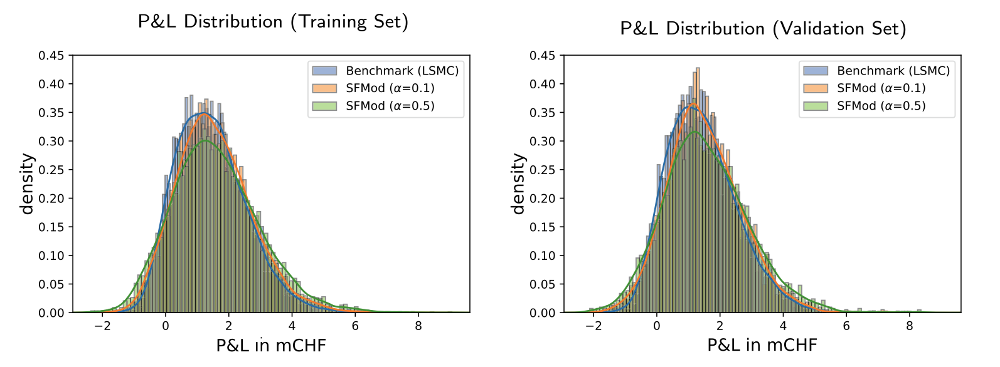
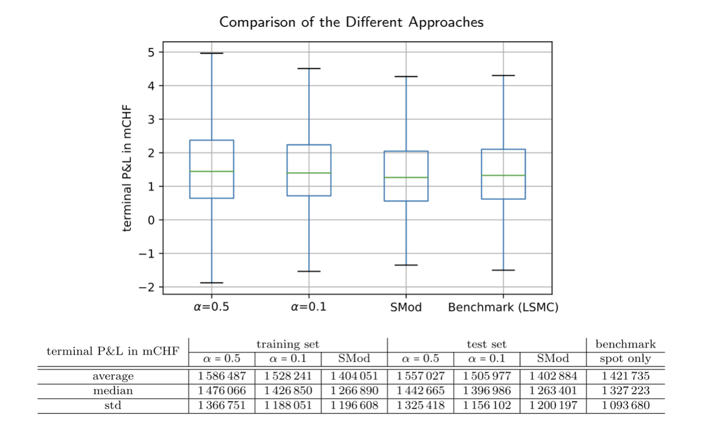

This section presents the experimental results obtained from evaluating two frameworks and compare them with the benchmark least-squares Monte Carlo methods. The analysis aims to provide insights into the performance and effectiveness of the proposed frameworks in comparison to the state-of-the-art methods, shedding light on their potential in addressing challenges within the complex gas market.

## 5.1 SMod
### Overall Runtime
The paper does not provide specific performance data for training the framework. Instead, it states that through various experiments, the authors evaluated training time based on factors including network depth, number of distinct neural networks, learning rates, and batch size, such empirical fine-tuning aimed to identify suitable settings for SMod. Furthermore, it turns out that it is unnecessary to build K(number of trading days) neural networks, but a higher parameter N(number of distinct neural network, $$ N \leq K $$, as parameter sharing is allowed) accelerates the learning process of the required solution complexity. They concluded that training generally completed quickly and was manageable on a standard 8-core notebook. For example, training SMod with K neural networks and 1000 epochs on 6000 scenarios took less than 2 hours. A key advantage of the proposed deep learning approach is its flexibility in scheduling strategy network training. Additionally, trained strategies can be promptly evaluated within seconds, which is comparable to that of the LSMC approach, highlighting the approach's efficiency.
### Terminal P&L

The above figure illustrates the p&l distribution comparison between the spot-only and benchmark models across both training and validation sets. Following 1000 epochs over 6000 scenarios, utilizing a learning rate of 0.001, a batch size of 64, and a risk aversion rate of $$\gamma=3$$, the artificial financial agent's strategy approaches the benchmark solution notably. 

## 5.2 SFMod
### Overall Runtime
When assessing this more intricate framework, their primary emphasis remained on the comparison of terminal p&l rather than runtime complexity. More illustrative data regarding runtime performance was not provided, they indicated that, relative to SMod, SFMod entails a marginally more complex technical setup as expected. However, in terms of computational time and effort, it remains properly manageable on a standard 8-core notebook.

### Terminal P&L

For SFMod, they adhered to the same network architecture as employed in SMod, wherein strategy networks were trained for 1000 epochs over 6000 training samples, a learning rate of 0.001, a batch size of 64, and a risk aversion rate of $$\gamma=3$$ utilized in the utility function. The above plots depicts the comparison of the profit and loss (p&l) distribution of SFMod with varied choices for $$\alpha$$ against that of the benchmark (LSMC) in both in-sample and out-of-sample tests. In both plots, the p&l distribution of SFMod does not exhibit conclusively superior performance compared to the benchmark. Furthermore, $$\alpha$$ also impacts the P&L distribution due to scaling variations between spot and forward trading. As illustrated in the plot, the resulting curve for $$\alpha=0.1$$ closely aligns with the benchmark, whereas that for $$\alpha=0.5$$ indicates a riskier strategy, as evidently there is higher probability of either significant profit ($$p\&l > 2$$) or loss ($$p\&l < 0$$). This outcome stems from more involvement in "high risk but high return" forward trading.

The box plot and the table present visual and detailed summary statistics for comparing SFMod with SMod and its benchmark. This comparison was conducted under identical conditions for the spot strategy component and consistent training setup. The higher position of the green line(median) and the generally longer box confirms that compared with the spot-only model, SFMod exhibits a slightly higher average p&l and increased volatility due to its inclusion of forward trading. Additionally, the parameter $$/alpha$$ controls the distribution, as demonstrated in the above probability density function of p&l. Analytical findings indicate that SFMod, enabling trading activities in forwards, represents the most favorable choice for maximizing expected terminal wealth.

---